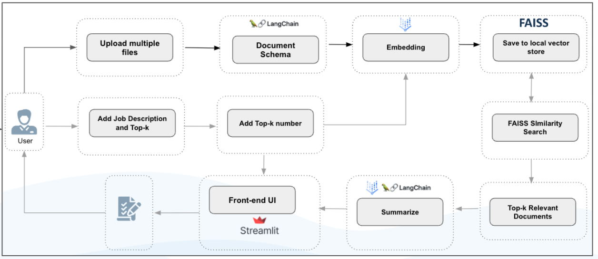
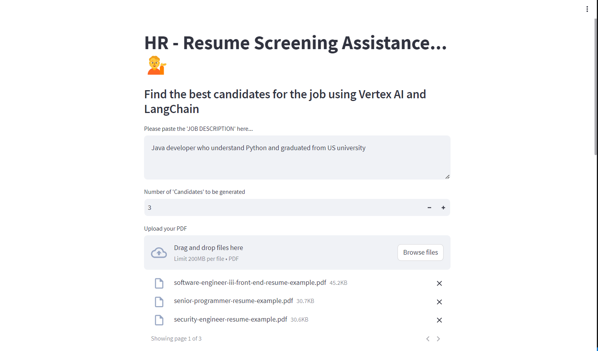
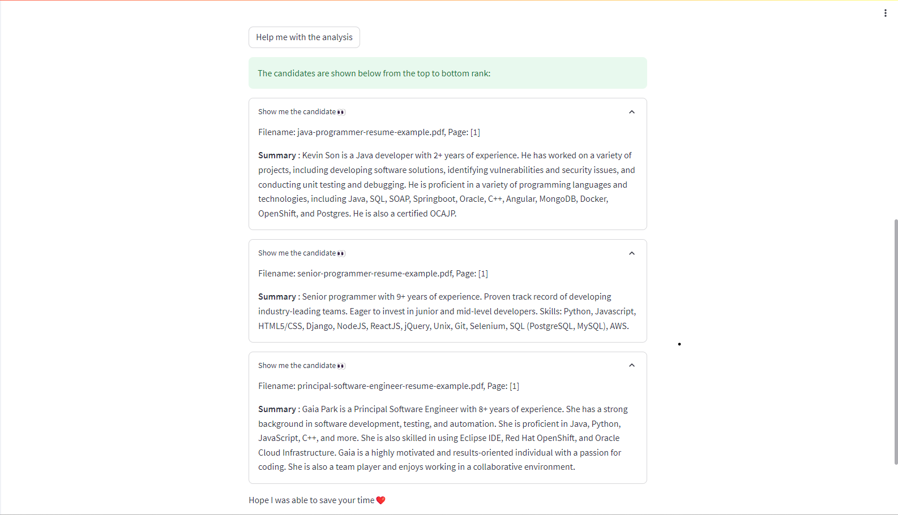

## Resume Screening Assistant using Streamlit, Langchain, FAISS, and Vertex AI



### Project Overview
This project is a document processing and analysis tool that leverages advanced machine learning techniques to embed, search, and summarize large collections of documents. It's built for users who need to quickly find relevant documents based on a job description.

Given a knowledge base whose vectors are stored in a pinecone, the chatbot provides answers to the questions that are most relevant to the context (called as knowledge base == vector).

### Tech Stack

- [**Streamlit**](https://streamlit.io/): For creating the front-end interface that users interact with.
- [**Langchain**](https://python.langchain.com/docs/get_started/introduction): Used for generating embeddings of the documents.
- [**FAISS**](https://faiss.ai/index.html): A library for efficient similarity search and clustering of dense vectors.
- [**Vertex AI**](https://cloud.google.com/vertex-ai?hl=en): For managing, deploying, and using AI models, involved in embedding and or summarization tasks.

### Features
1. **Upload Multiple Files**: Users can upload multiple documents which are then processed to fit a specific document schema.
2. **Add Job Description and Top-k**: Users input a job description and specify the number of top relevant documents to retrieve (Top-k).
3. **Embedding with LangChain**: Documents are passed through LangChain for embedding.
4. **FAISS Vector Storage**: The embeddings are saved to a local vector store using FAISS.
5. **FAISS Similarity Search**: A similarity search is conducted to find the most relevant documents.
6. **Retrieve Top-k Relevant Documents**: The system outputs the top-k relevant documents.
7. **Summarize**: Documents can be summarized for quicker review.
8. **Clear Vector Store**: To run with new list of documents, please click `Clear Cache Data` in the sidebar

**Screenshot**: Uploading list of documents


**Screenshot**: Getting The Result with The Summary


### Installation
Follow the steps below to set up and run the Resume Screening Assistant:

#### 1. Clone the Repository

```bash
git clone https://github.com/ridwanspace/resume-screening-langchain-vertexai.git
cd resume-screening-langchain-vertexai
```

#### 2. Install Dependencies
```bash
pip install -r requirements.txt
```

#### 3. Put your service account json file into the root folder
```json
{
  "type": "service_account",
  "project_id": "xxxx",
  "private_key_id": "xxx",
  "private_key": "xxxxx",
  "client_email": "xxxx",
  "client_id": "xxxxx",
  "auth_uri": "https://accounts.google.com/o/oauth2/auth",
  "token_uri": "https://oauth2.googleapis.com/token",
  "auth_provider_x509_cert_url": "https://www.googleapis.com/oauth2/v1/certs",
  "client_x509_cert_url": "https://www.googleapis.com/robot/v1/metadata/x509/xxxxxxxxxxx.iam.gserviceaccount.com",
  "universe_domain": "googleapis.com"
}
```

#### 4. Create `.env` then fill them with your own credentials
```bash
PROJECT_ID = xxxxxxx
SERVICE_ACCOUNT = xxxxx.json
```

#### 5. Run the App to screen the CVs/Resumes
```bash
streamlit run app.py
```
Visit the provided URL in your browser to interact with the PDF chatbot.


### Cost
Check this [pricing](https://cloud.google.com/vertex-ai/pricing#generative_ai_models) in Google Cloud

